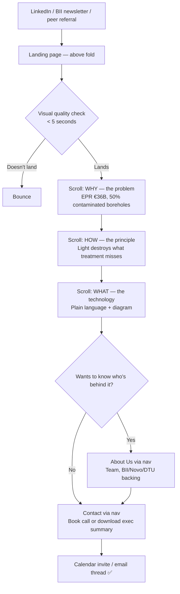
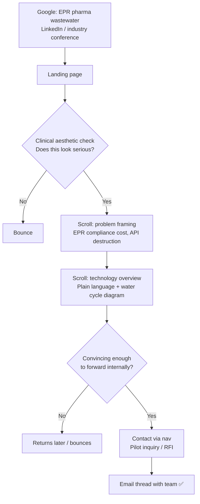

# UX Design Specification vasuqi

**Author:** Edda
**Date:** 2026-05-20

---

<!-- UX design content will be appended sequentially through collaborative workflow steps -->

## Executive Summary

### Project Vision

Vasuqi is pre-seed. There is no prototype. The website is not a product showcase —
it is a brand proof of concept. At this stage, Vasuqi is selling a vision: a credible
team, a real market problem secured by legislation, and a scientific principle with
IP potential. The brand is built around a product that doesn't exist yet, which means
the visual identity, the golden circle narrative, and the emotional USPs carry the
entire trust architecture.

The golden circle is the content strategy:
- **WHY:** The last 5% of water treatment is where all the toxicity and cost live. That's unacceptable.
- **HOW:** Light destroys what no other technology can touch.
- **WHAT:** A plug-in reactor that finishes the job.

The site leads with WHY. Always. The product is secondary to the mission.

Unifying emotional core: **confidence in completion** — Vasuqi is the first clean answer to the last 5% of water treatment where all the toxicity and cost live.

Catchphrase: *"Water, polished with light."*

### Target Users

**Primary: The Generalist Impact Investor**
Managing Partner / Investment Director at an ESG or Green-Tech fund. Finance or business background — not a chemist. Motivated by regulatory certainty (EU Directive 2024/3019 EPR locked in by EU Court ruling in 2026), asymmetric return potential, ARR via Hardware-as-a-Service, and institutional de-risking through BII/Innofounder. Needs to quickly understand: what's the market, why now, why Vasuqi, who's behind it. Resonates with "The Bankability of Light" as a metaphor for transparency and clean returns.

Journey: LinkedIn / BII newsletter → Homepage → About / Team → Contact / exec summary download.

**Secondary: The Industrial Decision-Maker (Chooser)**
Director-level at pharma or cosmetics — environmental compliance, sustainability, or operations. Evaluating whether Vasuqi is worth a conversation, not yet buying. They understand the EPR compliance problem personally. Plain-language explanation of how the technology works plus a diagram showing where it fits in their treatment process is enough at this stage.

Journey: Google / industry network → Homepage → Technology overview → Contact.

**Secondary: The Technical Engineer ("User")**
The validator a Compliance Architect may forward the site to. At pre-seed with confidential IP, this is not a primary design target. Light credibility signals suffice: DTU/BII logos, one LaTeX hydroxyl-radical equation, a schematic-level process visual. No dedicated tech section.

**Not targeted in Phase 1:** Small producers, pilot buyers.

### Technology Communication Approach

Vasuqi's technology is explained in plain language — accessible to any decision-maker without a chemistry background. The "how it works" section uses common language to explain the principle (light destroys pollutants that conventional treatment misses) supported by a single diagram showing where Vasuqi's system slots into an existing industrial water treatment cycle. No deep technical documentation — the IP is pre-patent and confidential, and the primary audience doesn't need it at this stage.

### Key UX Design Challenges

1. **The brand is the prototype.** With no physical product, visual identity, the golden circle narrative, and the emotional USPs are the entire trust architecture. Every design decision is a credibility signal.

2. **One homepage, two audiences.** Investor and decision-maker land in the same place with different questions. The hero must orient both instantly without splitting the page.

3. **Trust without a track record.** Institutional backing (BII, Innofounder, DTU) is the primary trust layer. Team transparency is the second. Both must appear early and be visually prominent.

4. **Aesthetic calibration.** Electric blue LED + Clinical Navy + Ice White: sophisticated enough for investors, clinical enough for pharma decision-makers.

5. **Pre-seed stage framing.** The site communicates ambition and market readiness without overselling traction that doesn't exist. Honest, confident, precise.

### Design Opportunities

1. **"The Bankability of Light" as a unifying visual and narrative metaphor.** Light is both the product input and the brand promise — rare coherence between technology and identity.

2. **Regulatory urgency as a conversion mechanism.** The 2028 EPR deadline creates real time pressure. A clear timeline showing regulatory milestones turns complexity into a reason to engage now.

3. **Brand mythology as emotional depth.** The Vasuki origin story — the cosmic serpent that churned contamination into purity — gives the About page an unusually strong narrative anchor for a pre-seed company.

4. **Plain-language technology + one diagram.** The decision to explain the technology in common language is a UX strength, not a compromise. It respects the audience's time and keeps focus on the business case.

## Core User Experience

### Defining Experience

The core "interaction" on this site is not a task — it is a trust evaluation. Both primary audiences scroll to answer one question: *is this real, is this credible, do I want to know more?* The conversion event is a single action: booking a meeting or downloading the exec summary. Everything else is scaffolding for that moment.

### Platform Strategy

Desktop-primary — investors research in boardroom or office contexts. The site must be fully responsive to 320px (mobile cannot be embarrassing) but layout, typographic hierarchy, and side navigation are optimised for large screens. Static MPA, native browser scroll.

### Navigation Structure

The navigation bar is persistent across all four pages. It is a **pill-shaped (stadium) glassmorphism bar** — frosted/glass background, fully rounded ends — floating above page content.

Exact layout: **[News & Documentations] · [icon + vāsuqi wordmark] · [About us] [Contact]**

- Left: "News & Documentations" — text link in `--blue-primary`
- Center: circular water icon + "vāsuqi" wordmark (macron over ā) — links to top of index.html (this is the home destination; no separate "Home" text link)
- Right: "About us" text link + "Contact" as a filled blue pill button (CTA)

The Contact button is always visible — no hunt required. All four-page destinations are reachable from the nav on every page without following the landing page scroll.

### Effortless Interactions

- The investor reaches the core WHY narrative without scrolling past anything that feels like padding
- Contact is one click from anywhere — always in the nav bar
- The technology explanation is scannable in 30 seconds — the diagram does the work, text labels it
- Institutional logos (BII, Innofounder, DTU) are visible without navigating away from the landing page

### Critical Success Moments

1. **Above the fold, within 5 seconds:** both audiences know what Vasuqi does and the visual quality registers as serious
2. **First institutional logo sighting:** skepticism drops — someone credible has already vetted this
3. **About Us page (nav destination):** the company becomes real people with identities and credentials, not a pitch deck
4. **Contact CTA:** always in the nav — a natural next step, never a sales form

### Experience Principles

1. **Brand confidence over information density** — every element earns its place; empty space is trust
2. **WHY leads, WHAT follows** — golden circle as the scroll order; mission before product
3. **Credibility is visual before it is verbal** — institutional logos and aesthetic quality do trust work before a word is read
4. **One clear next step at every moment** — Contact is always visible in the nav; no decision fatigue

## Desired Emotional Response

### Primary Emotional Goals

**Confidence in completion** is the single emotional core.

Vasuqi exists because the last 5% of water treatment has never had a clean answer. The site's job is to make investors and decision-makers feel, for the first time, that it does. Not hope — confidence. Not curiosity — certainty.

### Emotional Journey Mapping

| Stage | Target emotion | What triggers it |
|---|---|---|
| Discovery (LinkedIn, referral) | Intrigued — "this looks different" | Visual quality; tagline clarity |
| Above the fold | Oriented + calm — "I understand what this is" | Clear WHY statement; strong art direction |
| Scrolling the narrative | Growing conviction — "this market is real" | Regulatory data; timeline; market size |
| About Us page (nav destination) | Reassured — "real people, real validation" | Faces, titles, BII/Novo/DTU logos |
| Technology section | Elegance — "they've actually figured it out" | Plain-language clarity + diagram |
| Contact CTA (always in nav) | Ready — "worth 30 minutes" | Always visible, zero friction |

### Micro-Emotions by USP

| USP | Micro-emotion | Design trigger |
|---|---|---|
| Relief | "Finally, a clean answer" | WHY-first narrative; problem stated before solution |
| Certainty | "I know exactly what I'm getting" | Diagram over description; precise language |
| Control | "We chose this — we weren't forced" | Framing EPR as opportunity, not threat |
| Credibility | "We can prove it works" | Institutional logos early; team credentials on About page |
| Elegance | "These people have figured it out" | Visual restraint; zero clutter; brand coherence |

### Emotions to Avoid

- **Overwhelm** — too much technical depth before the investor is oriented
- **Skepticism about stage** — never imply more traction than exists; honest precision builds more trust than overselling
- **Complexity anxiety** — the technology must feel approachable, not intimidating

### Design Implications

- **Confidence → spacious layout, measured pacing.** White space signals control. Cramped = anxious.
- **Certainty → diagram over prose.** One strong visual makes the mechanism feel real faster than three paragraphs.
- **Reassurance → faces before logos.** Team photos humanise before institutional stamps validate — but this lives on the About page, not the landing scroll.
- **Elegance → restraint in motion.** Water physics animations: slow, fluid, nothing that grabs. The brand moves like it's in control.
- **Ready to act → persistent nav CTA.** The Contact button lives in the navigation bar — always visible, zero hunt required.

## Design System Foundation

### Design System Choice

**Custom design system** built on Tailwind CSS v4 + CSS custom properties. No third-party component library. All components are bespoke, derived from the four material languages: Water, Glass, Blueprint, Light.

### Rationale

- Brand is the product at pre-seed — a generic component library would undermine the visual identity that carries all trust signalling
- Tailwind CSS v4 via `@tailwindcss/vite` provides utility-layer consistency without imposing component opinions
- All design values (colour, typography, spacing, motion) live in `design-tokens.css` as CSS custom properties — single source of truth for both the site and the design manual

### Implementation Approach

`design-tokens.css` at project root defines the complete token system. Tailwind's `@theme` block extends the utility layer to reference tokens directly — no duplicate values, no magic numbers in stylesheets. Component markup is hand-authored in HTML; no JS component framework.

### Customisation Strategy

The nav bar (pill-shaped glass), section cards, and CTA button are the primary bespoke components. Each derives from the Glass material language: `-webkit-backdrop-filter` + `backdrop-filter`, `--ice-near` border, `--white-brand` background (at ~80% opacity). New components follow the Component Derivation Protocol in the design manual.

## Defining Experience

### The Core Interaction

The defining experience of the Vasuqi site is **the first scroll** — from the intro animation through the hero to the first narrative section. This is a marketing site, not a product app; there is no task to complete. The interaction is a trust evaluation, and the defining moment is the 5–10 seconds after page load. If this lands, the visitor stays.

The intro animation plays once per session (suppressed on return via sessionStorage), setting the visual tone before any text is read. The hero then carries the WHY statement. Everything after deepens conviction in sequence.

### User Mental Model

Investors and decision-makers arrive with a "show me in 10 seconds" mental model. They pattern-match on visual quality before reading a word — aesthetic seriousness is evaluated before content credibility. They are not looking for a feature list; they are asking: *does this feel like something real?*

They are accustomed to scrolling editorial-style long-form pages. The scroll-narrative pattern is familiar. What must be novel is the visual language that makes Vasuqi feel distinct from generic cleantech.

### Success Criteria

- Visitor scrolls past the fold — the intro animation + hero earned another 30 seconds
- Visitor reaches the "how it works" diagram — conviction is building
- Visitor navigates to About Us via nav — they want to know who is behind it
- Visitor clicks Contact — the narrative landed

### Pattern Analysis

**Established patterns:** Fixed glassmorphism nav, scroll-triggered section animations, anchor side navigation on desktop (`lg`+), single persistent CTA in nav.

**Novel to Vasuqi:** Intro animation as brand immersion (not a loader); water physics easing on all motion — coherent, slow, fluid, nothing snaps; four material languages generating visual vocabulary that doesn't exist elsewhere in cleantech.

### Experience Mechanics

**1. Initiation — page load**
Intro animation plays on first paint (no pre-loader). Water physics motion sets the brand register before the hero is visible. Plays once per session only.

**2. Interaction — the scroll narrative**
Visitor scrolls through sections in golden-circle order: WHY → HOW → WHAT → WHO (via nav to About Us). Each section animates in on scroll via GSAP ScrollTrigger with water physics easing. Side navigation (desktop, `lg`+) shows current position and allows direct section jumping.

**3. Feedback — scroll animations**
Every section entrance is a micro-confirmation that the page is alive. Water physics easing (1.0s default, `power1.inOut`) signals control and precision — the brand moves the way the technology is supposed to work.

**4. Completion — the contact action**
No completion state on the page. The Contact CTA (always in nav) is the exit point. Success is a calendar invite or an email thread, not a form confirmation.

## Visual Design Foundation

### Color System

10-token palette, all defined in `design-tokens.css` as CSS custom properties:

| Token | Hex | Role |
|---|---|---|
| `--navy-deep` | #0A1F44 | Primary background, deepest layer, body text on light surfaces |
| `--blue-primary` | #0044FF | Brand blue — CTAs, links, active states |
| `--blue-deep` | #0033CC | Hover states, secondary actions |
| `--blue-mid` | #6A93FF | Highlights, electric LED accent |
| `--blue-soft` | #A8C5FF | Subtle accents, illustrations |
| `--cyan-light` | #00E5FF | Electric water tones, strong accent |
| `--steel` | #5C6B85 | Secondary text, section subheadings, borders |
| `--ice-light` | #D6F8FF | Glass surface highlights, light backgrounds |
| `--ice-near` | #E8F2FF | Glass background base, nav bar border |
| `--white-brand` | #FAFCFF | Near-white, text on dark backgrounds, nav bar bg |

No hex values used directly in stylesheets — always via token. WCAG 2.1 AA contrast required on all text/background pairs.

### Typography System

- **Display / headings:** Syne (variable weight) — geometric, technical, distinctive
- **Body:** Manrope — humanist, readable, approachable at small sizes; used for all body text including footer
- Loaded via Google Fonts `<link rel="preconnect">` + `<link>` in each HTML `<head>`
- Full type scale defined in `design-tokens.css` via Tailwind `@theme`
- **Montserrat must not appear anywhere on the site.** Some Figma frames (notably the footer) show Montserrat — this is a Figma error. Use Manrope for all non-heading text without exception.

### Spacing & Layout Foundation

- **Base unit:** 4px (Tailwind default scale)
- **Breakpoints:** Tailwind v4 defaults — `sm` 640px, `md` 768px, `lg` 1024px, `xl` 1280px
- **Layout approach:** Spacious — white space is a trust signal; no dense information blocks
- **Max content width:** contained at `xl` (1280px); full-bleed backgrounds extend to viewport edges

### Material Languages as Visual System

| Language | Visual character | Primary use |
|---|---|---|
| **Water** | Flowing gradients, organic shapes, depth | Hero backgrounds, section transitions |
| **Glass** | Frosted blur, translucent surfaces, light refraction | Nav bar, cards, overlays |
| **Blueprint** | Technical linework, grid structures, precision | Diagram sections, data callouts |
| **Light** | Electric blue glow, LED accent, luminosity | CTA button, hover states, animated elements |

### Accessibility

WCAG 2.1 AA throughout. Animations run unconditionally — deliberate design decision documented in architecture. `aria-hidden="true"` on all decorative motion and video. All interactive elements have visible focus states in `--blue-primary`.

## Design Direction

**Water · Whitespace · Light · Subtle motion · Clean**

The design direction is resolved in the Figma prototype. No exploration of alternatives was needed — the brand identity and visual language were defined prior to this workflow.

The five words govern every component and layout decision:

- **Water** — organic shapes, gradient depth, the material language that connects brand to product
- **Whitespace** — generous spacing as a trust signal; nothing competes for attention
- **Light** — `--blue-mid` / `--blue-primary` as the electric accent; luminosity over decoration
- **Subtle motion** — water physics easing throughout; animations that feel inevitable, not performative
- **Clean** — no visual noise; every element earns its place or is removed

The Figma prototype is the source of truth for implementation. This spec documents the intent behind those decisions so AI agents can derive consistently from the same principles.

## User Journey Flows

Two defined journeys. Investor is primary; compliance architect is secondary. Both enter through the site and exit via Contact.

### Journey 1: The Generalist Impact Investor

**Goal:** Assess investment potential → book a call or download exec summary.

**Key moments:** Above fold visual quality check; institutional logos on landing before About Us; About Us is opt-in via nav, not forced in the scroll.

### Journey 2: The Industrial Compliance Architect

**Goal:** Determine if Vasuqi is worth a conversation → request pilot inquiry.

**Key moments:** Aesthetic must read as clinical-serious instantly; technology must be plain enough for a director, credible enough to forward; no gating before Contact.

### Journey Patterns

- **Entry → evaluate aesthetics → scroll if passing → act via nav** — both journeys share this trust-evaluation pattern; the nav is the action layer throughout
- **Page navigation is opt-in** — About Us and News & Docs are available but never required to reach Contact
- **No error states** — static marketing site; only error-recovery is the contact form success/failure feedback

### Flow Optimisation Principles

1. **Minimum steps to Contact** — CTA always in nav; zero additional clicks from any position
2. **No forced navigation** — landing page works independently of About Us
3. **Trust before conversion** — institutional logos appear in the scroll before Contact is reached
4. **Plain language at technology** — removes the "I need an expert" barrier for the compliance architect

## Component Strategy

All components are hand-authored HTML + Tailwind + CSS custom properties. No third-party component library. Every component derives from one of the four material languages.

| Component | Material language | Page(s) | Notes |
|---|---|---|---|
| **Nav bar** | Glass | All | Pill-shaped, centered logo, persistent Contact CTA |
| **Footer** | Blueprint | All | Two-column, social links as inline SVG |
| **Hero section** | Water + Light | Landing | Video bg + left-aligned headline + WHY statement (no glass panel) |
| **Intro animation** | Water + Light | Landing | GSAP sequence, first paint, once per session |
| **Floating light bg** | Light | Landing | Persistent ambient element, GSAP |
| **Section scroll animations** | Water | Landing | ScrollTrigger, one per section, `once: true` |
| **Water cycle diagram** | Blueprint | Landing | SVG, mobile layout differs from desktop |
| **Contact CTA button** | Light | All (nav) | Filled blue pill, `--blue-primary` |
| **Team card** | Glass + Water | About Us | Blob morphing photo (GSAP), name, title, bio |
| **News & events carousel** | Blueprint | News & Docs | Horizontally scrollable row of manually maintained cards; each card shows publication name, headline, date; all clicks link externally (`target="_blank"`); no JS carousel library — CSS `overflow-x: auto` + `scroll-snap-type` |
| **Download card** | Blueprint | News & Docs | Thumbnail image + label; 2-column grid; used in Documents and Press & Brand sections; download action on click |
| **Contact form** | Glass | Contact | Intercept-submit, explicit success + error states, no silent failure |
| **Product visualisation** | Blueprint + Light | Landing | "How it works" globe, CSS keyframes |
| **Benefit elements** | Water + Light | Landing | 4 blob-shaped elements in `#what-its-built-to-change`; organic CSS `border-radius` + iridescent `conic-gradient` shimmer border; SVG icon + numbered label + title + description; assets: `recovery.svg`, `compliance.svg`, `disposal.svg`, `opex.svg` |
| **Pollutant icon cards** | Blueprint | Landing | 4 icon cards in `#how-it-works` "What Vāsuqi is built to address" subsection after product visualisation; assets: `pharma.svg`, `Factory.svg`, `Dyes.svg`, `EU drop.svg`; same border/background as `.hiw-card` |

### Implementation Priority

**Phase 1 — structural:** `design-tokens.css` → nav bar → footer → hero → 4 HTML pages wired to entry points

**Phase 2 — landing page experience:** Intro animation → floating light → scroll animations → water cycle diagram → product visualisation

**Phase 3 — supporting pages:** Team cards + blob morphing (About Us) → news & events carousel + download cards → contact form

### Component Derivation Protocol

For any component not listed: (1) identify its material language, (2) determine if it's structural, decorative, or interactive, (3) apply that language's visual properties, (4) apply the Same Designer Test — would it feel consistent next to an existing component?

## UX Consistency Patterns

### Button Hierarchy

**Primary — Contact CTA** (filled blue pill, `--blue-primary` bg, `--white-brand` text)
Used once: in the nav bar. Never duplicated as a page-level button — keeps the action singular and unambiguous.

**Secondary — text links** (`--blue-primary`, no underline by default, underline on hover)
Used for in-page navigation and external references (BII, DTU, Novo links).

**No tertiary buttons.** If a new interactive element is needed, derive from the material language — not from a generic button pattern.

### Feedback Patterns

Only one feedback context: the contact form.

- **Success:** A pre-existing HTML element (not JS-injected) becomes visible — confirmation in human tone
- **Error:** A pre-existing HTML element becomes visible — clear, non-alarming, offers a direct email alternative
- **Silent failure is not acceptable.** Every submission gets an explicit response.

### Form Patterns

One form: the contact form on the Contact page.

- JS intercepts submit (`e.preventDefault()`), POSTs to Formspree, toggles feedback elements
- Required fields: **name, email, message — no more than necessary**
- The Figma wireframe shows additional fields (Lastname, Phone Number, Company name, Job title) — these are NOT part of the spec and must not be implemented. The 3-field form is intentional: low friction is a conversion principle for this audience.
- Validate on submit only — no inline validation on blur (low-friction, single-attempt form)
- Mobile: full-width inputs, thumb-reachable submit button

### Navigation Patterns

- **Persistent pill nav** — always visible, never hides on scroll
- **Active page state** — current page indicated in nav via text link style
- **Logo = home** — clicking the centered logo returns to top of index.html; there is no separate "Home" text link
- **Side navigation** — current implementation desktop only (`lg`+), shows section anchors on the landing page, updates on scroll to reflect current section. Mobile equivalent is in development and will be specified and added when ready.

### Scroll & Animation Patterns

- **Section entrance:** elements animate in on scroll-into-view, `once: true` — never re-animate on scroll-out
- **No hover animations on mobile** — touch devices skip hover states
- **Water physics everywhere:** duration 0.8–1.2s, `power1.inOut`, 0.12s stagger — imported from `src/animations/constants.js`, never hardcoded

### Empty & Loading States

Not applicable — static site, no async data loading. The only async operation is the contact form POST, handled by the feedback pattern above.

## Core User Experience

### Defining Experience

The core "interaction" on this site is not a task — it is a trust evaluation. Both primary audiences scroll to answer one question: *is this real, is this credible, do I want to know more?* The conversion event is a single action: booking a meeting or downloading the exec summary. Everything else is scaffolding for that moment.

### Platform Strategy

Desktop-primary — investors research in boardroom or office contexts. The site must be fully responsive to 320px (mobile cannot be embarrassing) but layout, typographic hierarchy, and side navigation are optimised for large screens. Static MPA, no app-like interactions, native browser scroll.

### Effortless Interactions

- The investor reaches the core WHY narrative without scrolling past anything that feels like padding
- "Talk to our CEO" is one click from anywhere on the site
- The technology explanation is scannable in 30 seconds — the diagram does the work, the text labels it
- Institutional logos (BII, Innofounder, DTU) are visible without scrolling to a footer

### Critical Success Moments

1. **Above the fold, within 5 seconds:** both audiences know what Vasuqi does and the visual quality of the brand registers as serious
2. **First institutional logo sighting:** skepticism drops — someone credible has already vetted this
3. **Team section:** the company becomes real people with identities and credentials, not a pitch deck
4. **Contact CTA:** a single, low-friction action that feels like a natural next step, not a sales form

### Experience Principles

1. **Brand confidence over information density** — every element earns its place; empty space is trust
2. **WHY leads, WHAT follows** — golden circle as the scroll order; mission before product
3. **Credibility is visual before it is verbal** — institutional logos and aesthetic quality do trust work before a word is read
4. **One clear next step at every moment** — no decision fatigue; the path forward is always obvious

## Responsive Design & Accessibility

### Responsive Strategy

**Desktop-primary** — the primary investor audience researches in office/boardroom contexts. Desktop layout carries the full experience: side navigation, multi-column sections, full animation fidelity.

**Mobile-first authoring** — all base styles target 320px; responsive prefixes (`sm:`, `md:`, `lg:`, `xl:`) layer in progressively. Mobile cannot be embarrassing even if it's not the primary use case.

**Tablet** — treated as a wide mobile experience. No tablet-specific layouts; `md` and `lg` breakpoints handle the transition naturally.

### Breakpoint Strategy

Tailwind v4 defaults — no custom breakpoints:

| Breakpoint | Width | Key layout change |
|---|---|---|
| base | 320px | Single column, stacked sections |
| `sm` | 640px | Minor spacing and type adjustments |
| `md` | 768px | Water cycle diagram switches from mobile to full layout |
| `lg` | 1024px | Side navigation appears; desktop multi-column layouts |
| `xl` | 1280px | Max content width — content containers stop growing |

### Accessibility Strategy

**WCAG 2.1 AA** throughout.

- **Animations:** Run unconditionally — deliberate design decision (see architecture). Water physics motion is low-intensity and ambient; the trade-off was evaluated and accepted.
- **Decorative elements:** `aria-hidden="true"` on hero video, floating light, blob morphing, and all decorative SVGs
- **Focus states:** Visible, on-brand focus rings in `--blue-primary` on all interactive elements
- **Semantic HTML:** Proper heading hierarchy, landmark regions (`<nav>`, `<main>`, `<footer>`, `<section>`), descriptive `<title>` and `<meta name="description">` per page
- **Form:** Explicit `<label>` elements for all inputs; error and success states do not rely on colour alone
- **Touch targets:** Minimum 44×44px on all interactive elements

### Browser & Device Support

Last 2 major versions: Chrome, Firefox, Safari, Edge. Safari 15+ minimum. Safari-specific: `-webkit-backdrop-filter` alongside standard `backdrop-filter` on all glass components.

### Implementation Guidelines

- All units relative (`rem`, `%`, `vw`/`vh`) — no fixed pixel values in layout
- Images below the fold: `loading="lazy"`
- Inline SVG for icons and small decorative elements
- `<video>` hero: `autoplay muted loop playsinline`, `poster` attribute set, `aria-hidden="true"`
- Water cycle diagram: separate mobile layout at `md`, not just scaling
